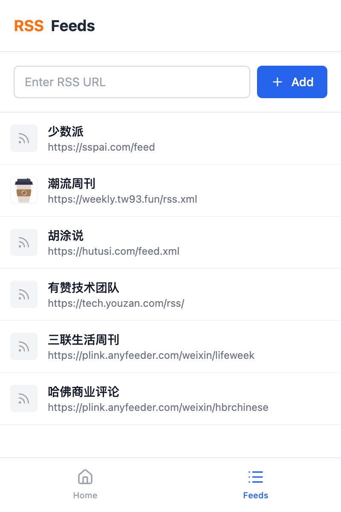

# Chrome RSS 阅读器扩展

<div align="center">
  
  
</div>

一个使用 React、Vite 和 Tailwind CSS 构建的现代化 RSS 阅读器 Chrome 扩展。

## 功能特性

- 📖 在干净、现代的界面中阅读 RSS 订阅源
- 🔍 在未读和全部文章之间切换过滤
- ✅ 手动或自动标记文章为已读
- 📱 针对浏览器扩展弹窗优化的响应式设计
- 🎨 使用 Tailwind CSS 的精美界面

## 开发环境

### 环境要求

- Node.js 18 或更高版本
- npm 或 yarn

### 环境配置

```bash
# 安装依赖
npm install

# 启动开发服务器
npm run dev

# 构建生产版本
npm run build

# 代码检查
npm run lint
```

### 在 Chrome 中加载扩展

1. 运行 `npm run build` 创建 `dist` 文件夹
2. 打开 Chrome 并访问 `chrome://extensions/`
3. 启用"开发者模式"
4. 点击"加载已解压的扩展程序"并选择 `dist` 文件夹

## 自动构建和发布

本项目包含了用于自动构建和发布的 GitHub Actions 工作流。

### 自动构建

扩展会在以下情况下自动构建：
- 推送到 `main` 或 `develop` 分支
- 向 `main` 分支提交 Pull Request
- 推送标签（创建发布版本）
- 手动触发工作流

### 创建发布版本

您可以通过两种方式创建新的发布版本：

#### 方法一：手动发布工作流
1. 在您的仓库中进入 GitHub Actions
2. 选择"Release"工作流
3. 点击"Run workflow"
4. 输入版本号（例如：`1.0.1`）
5. 点击"Run workflow"

这将：
- 更新 `manifest.json` 和 `package.json` 的版本号
- 构建扩展
- 创建 git 标签
- 创建包含扩展 zip 文件的 GitHub 发布版本

#### 方法二：Git 标签（手动）
```bash
# 手动更新 manifest.json 和 package.json 中的版本号
# 然后创建并推送标签
git tag v1.0.1
git push origin v1.0.1
```

### 构建产物

每次构建都会创建：
- 可直接上传到 Chrome 网上应用店的 zip 文件
- 保存 30 天的构建产物
- 为标签版本自动创建的 GitHub 发布版本

## 项目结构

```
src/
├── components/          # React 组件
│   ├── ArticleCard.jsx  # 单个文章展示
│   ├── ArticleList.jsx  # 订阅源文章列表
│   ├── FeedList.jsx     # RSS 订阅源管理
│   ├── Home.jsx         # 主要文章信息流
│   └── NavBar.jsx       # 导航栏
├── utils/               # 工具函数
│   ├── rss.js          # RSS 解析逻辑
│   └── storage.js      # Chrome 存储工具
└── background/         # 扩展后台脚本
    └── service-worker.js
```

## Chrome 网上应用店部署

部署到 Chrome 网上应用店（可选）：

1. 取消 `.github/workflows/build-extension.yml` 中部署部分的注释
2. 设置 Chrome 网上应用店 API 凭据
3. 在仓库中添加 `BPP_KEYS` 密钥
4. 扩展将在标签发布时自动部署

## 贡献指南

1. Fork 仓库
2. 创建功能分支
3. 进行更改
4. 运行测试和代码检查
5. 提交 Pull Request

## 开源协议

MIT 协议
